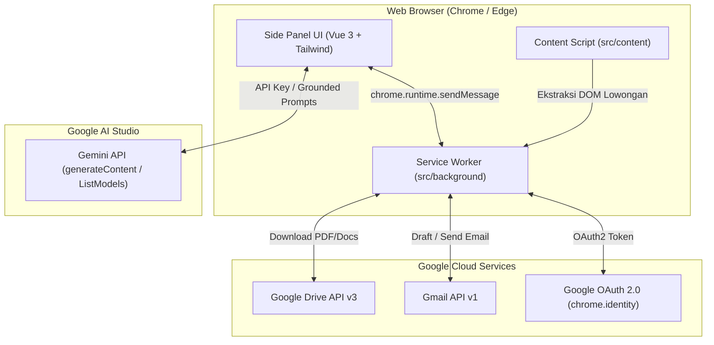

# Job Seek Assistant 🚀
### Chrome & Microsoft Edge Extension (Manifest V3)

> **AI-Powered Job Application Assistant with Grounded CV Memory, Real-time Web Scraping, Multi-Language Email Generation, and Direct Gmail Dispatch.**

Job Seek Assistant adalah ekstensi peramban (*browser extension*) Manifest V3 berbasis Vue 3, TypeScript, dan Tailwind CSS. Ekstensi ini dirancang untuk mendampingi pencari kerja secara end-to-end: mengekstrak informasi lowongan kerja dari portal karir aktif, menganalisis kecocokan (*match score & gap analysis*) terhadap CV pengguna secara objektif tanpa halusinasi, menghasilkan email lamaran terpersonalisasi dalam berbagai gaya dan bahasa, serta menyimpannya ke draf atau mengirimkannya langsung via Gmail API dengan lampiran CV asli.

---

## ✨ Fitur Utama

- **🖥️ Chrome Side Panel Modern UI**: Antarmuka responsif dan terintegrasi langsung di bilah samping (*side panel*) browser tanpa mengganggu alur penjelajahan.
- **📁 Google Drive CV Memory & Synchronizer**:
  - Pemilihan berkas CV langsung dari Google Drive v3 (format **PDF** & **Google Docs**).
  - Ekstraksi teks dokumen otomatis berbasis PDF.js dan export plain text Drive API.
  - Deteksi pembaruan berkas CV (*timestamp & checksum*) dengan sinkronisasi satu klik.
  - Fallback pengisian manual jika tidak menggunakan Google Drive.
- **🌐 Active Web Job Scraper Engine**:
  - Content script dengan ekstraktor khusus untuk portal kerja terkemuka: **LinkedIn Jobs**, **Glints**, **Jobstreet**, dan **Indeed**.
  - Ekstraktor heuristik universal untuk situs karir independen perusahaan.
  - Sanitasi teks otomatis untuk menangkal serangan *indirect prompt injection*.
- **🧠 Gemini AI Grounded Match & Gap Analysis**:
  - Menggunakan model Google Gemini (`gemini-2.0-flash` / `gemini-1.5-flash`).
  - *Context isolation* ketat dengan isolasi tag XML (`<candidate_cv>`, `<job_posting>`).
  - *Zero-hallucination guardrail*: AI dilarang keras mengarang atau menambahkan keahlian di luar isi CV pengguna.
  - Metrik visual: Skor Relevansi (0–100%), Matched Skills dengan bukti kutipan CV, Missing Skills (kesenjangan kualifikasi), dan Poin Sorotan Interview.
- **✉️ Multi-Tone & Multi-Language Email Generator**:
  - 3 variasi gaya email instan: **Formal**, **Impact / Project-focused**, dan **Concise Pitch**.
  - Pilihan bahasa fleksibel: **Bahasa Indonesia**, **English**, atau **Auto (menyesuaikan deskripsi lowongan)**.
  - **Iterative Refinement ("Masukan Perubahan")**: Perhalus draf email melalui perintah prompt revisi ke AI.
  - Deteksi otomatis email recruiter dari lowongan yang diekstrak.
- **📬 Dual Gmail Dispatch**:
  - **Simpan ke Draft**: Membuat draf resmi di kotak masuk Gmail pengguna (`users.me.drafts.create`).
  - **Kirim Email Langsung**: Mengirim email langsung via Gmail API (`users.me.messages.send`) dengan modal konfirmasi ringkasan.
  - Pembentukan payload MIME RFC 2822 base64url terenkapsulasi dengan opsi menyertakan berkas CV PDF asli dari Google Drive sebagai lampiran.
- **🛡️ Error Resilience & Offline Mode**:
  - Banner status offline otomatis di UI saat koneksi internet terputus.
  - *Silent token refresh* dan *auto-retry* jika sesi Google OAuth kedaluwarsa (HTTP 401).
  - Deteksi berkas CV terhapus di Drive (HTTP 404) dan batas kuota Gemini API (HTTP 429).
  - **Mode Simulasi (Demo Mode)** lengkap untuk evaluasi instan tanpa perlu mendaftar GCP atau API key.

---

## 🏗️ Arsitektur Sistem



---

## 📋 Prasyarat

- **Node.js**: Versi `>= 18.0.0` (disarankan Node.js 20 LTS atau 22 LTS).
- **Package Manager**: `npm` (disertakan bersama Node.js).
- **Google Chrome** (versi 116+) atau **Microsoft Edge** (versi 116+) dengan dukungan Side Panel API Manifest V3.
- *(Opsional)* **Google Gemini API Key**: Dapatkan gratis di [Google AI Studio](https://aistudio.google.com/). *(Jika tidak ada, Anda dapat menggunakan Mode Demo).*
- *(Opsional)* **Google Cloud Console OAuth 2.0 Client ID**: Untuk integrasi Google Drive & Gmail asli. *(Jika tidak ada, Anda dapat menggunakan Mode Demo).*

---

## 🚀 Panduan Instalasi Cepat

### 1. Kloning & Pasang Dependensi
```bash
git clone https://github.com/IlhamFatahillahR27/job-seek-assistant.git
cd job-seek-assistant
npm install
```

### 2. Jalankan Server Pengembangan atau Buat Build Produksi
- Untuk mode pengembangan dengan *hot module replacement*:
  ```bash
  npm run dev
  ```
- Untuk membuat build produksi teroptimasi:
  ```bash
  npm run build
  ```
  *Hasil build akan tersimpan di direktori `dist/` dan paket zip rilis akan otomatis terbentuk di `release/crx-job-seek-assistant-1.0.0.zip`.*

### 3. Memasang Ekstensi di Google Chrome
1. Buka Google Chrome dan ketik `chrome://extensions/` pada bilah alamat.
2. Aktifkan toggle **"Developer mode"** di pojok kanan atas.
3. Klik tombol **"Load unpacked"** di pojok kiri atas.
4. Pilih folder `dist/` yang berada di dalam direktori proyek ini.
5. Ekstensi **Job Seek Assistant** akan muncul di daftar ekstensi.
6. Sematkan (*pin*) ikon ekstensi pada toolbar browser, lalu klik ikon tersebut untuk membuka Side Panel.

### 4. Memasang Ekstensi di Microsoft Edge
1. Buka Microsoft Edge dan ketik `edge://extensions/` pada bilah alamat.
2. Aktifkan toggle **"Developer mode"** di panel samping kiri.
3. Klik tombol **"Load unpacked"**.
4. Pilih folder `dist/` proyek.
5. Klik ikon ekstensi untuk membuka panel samping.

---

## ⚙️ Panduan Konfigurasi

Buka tab **Pengaturan** di Side Panel ekstensi:

### A. Konfigurasi Google Gemini API
1. Buka [Google AI Studio](https://aistudio.google.com/) dan buat API Key baru.
2. Masukkan API Key pada kolom **Google Gemini API Key**.
3. Klik tombol **"Uji Koneksi"** untuk memverifikasi keabsahan kunci dan memuat daftar model aktif.
4. Pilih model yang diinginkan (default: `gemini-2.0-flash` atau `gemini-1.5-flash`).
5. *(Alternatif)* Centang **"Gunakan Mode Simulasi Gemini (Demo)"** untuk mencoba analisis tanpa API key.

### B. Konfigurasi Google Workspace (Drive & Gmail)
1. Lihat panduan lengkap pembuatan kredensial di [`docs/setup/google-oauth-setup.md`](docs/setup/google-oauth-setup.md).
2. Salin *OAuth 2.0 Client ID* dari Google Cloud Console dan tempelkan ke kolom **Google Client ID**.
3. Klik tombol **"Hubungkan Akun Google"** untuk melakukan login interaktif via Google Accounts.
4. *(Alternatif)* Centang **"Gunakan Mode Simulasi Google Drive & Gmail (Demo)"** untuk langsung menggunakan berkas CV mock dan simulasi pengiriman email tanpa konfigurasi GCP.

---

## 🛠️ Skrip Pengembangan & Pengujian

| Perintah | Deskripsi |
| :--- | :--- |
| `npm run dev` | Menjalankan Vite development server dengan integrasi `@crxjs/vite-plugin`. |
| `npm run test` | Menjalankan seluruh test suite otomatis menggunakan **Vitest** (16 test suite, 103+ tests). |
| `npm run test:watch` | Menjalankan Vitest dalam mode watch interaktif. |
| `npm run build` | Menjalankan typecheck TypeScript (`vue-tsc -b`) dan memaketkan ekstensi ke folder `dist/` serta membuat file rilis zip di `release/`. |

---

## 🧪 Rangkaian Pengujian Otomatis (Test Suite)

Proyek ini dilengkapi dengan 16 test suite otomatis yang mencakup 103 unit tests:
- `tests/unit/error-resilience.spec.ts`: Pengujian ketahanan offline, silent re-auth 401, error 404, dan limit kuota 429.
- `tests/unit/cv-parser.spec.ts`: Ekstraksi teks PDF & Docs serta fallback binary extractor.
- `tests/unit/cv-sync.spec.ts`: Deteksi perubahan berkas Google Drive dan sinkronisasi timestamp.
- `tests/unit/job-scrapers.spec.ts`: Parsing DOM LinkedIn, Glints, Jobstreet, Indeed.
- `tests/unit/job-extractor.spec.ts`: Heuristic fallback extractor untuk portal karir umum.
- `tests/unit/sanitizer.spec.ts`: Sanitasi teks dan pencegahan *indirect prompt injection*.
- `tests/unit/gemini-client.spec.ts`: Koneksi API Gemini, validasi key, auto-fallback model.
- `tests/unit/gemini-guardrail.spec.ts`: Evaluasi anti-halusinasi dan pencocokan keahlian.
- `tests/unit/email-generator.spec.ts`: Pembuatan draf multi-tone, multi-language, dan revisi iteratif.
- `tests/unit/mime-builder.spec.ts`: Pembentukan pesan MIME RFC 2822 base64url dengan lampiran PDF.
- `tests/unit/gmail-client.spec.ts`: Pembuatan draft dan pengiriman langsung via Gmail API.
- `tests/unit/google-auth.spec.ts`: Otentikasi OAuth2, refresh token, dan penanganan sesi.
- `tests/unit/storage.spec.ts`: Wrapper reaktif `chrome.storage.local`.
- `tests/unit/sidepanel-tabs.spec.ts`: Render navigasi tab dan antarmuka Side Panel.
- `tests/unit/use-email-generator.spec.ts`: Composable state management email generator.
- `tests/unit/job-analysis.spec.ts`: Composable alur analisis kecocokan pekerjaan.

Matriks penanganan error lengkap dapat dipelajari di [`docs/testing/error-matrix.md`](docs/testing/error-matrix.md).

---

## 🚀 Publikasi ke Web Store (Chrome & Edge)

Panduan komprehensif untuk mempublikasikan ekstensi ke toko peramban resmi:
- **Panduan Publikasi Toko**: [`docs/deployment/store-publishing-guide.md`](docs/deployment/store-publishing-guide.md) (Langkah upload, checklist aset, dan justifikasi permission).
- **Kebijakan Privasi Publik**: [`PRIVACY_POLICY.md`](PRIVACY_POLICY.md) (Wajib dicantumkan saat upload ke Google & Microsoft).
- **Paket ZIP Rilis**: Siap diunggah langsung dari `release/crx-job-seek-assistant-1.0.0.zip` (dihasilkan otomatis via `npm run build`).
- **Biaya Pendaftaran Developer**:
  - **Microsoft Edge Add-ons**: **GRATIS ($0 / Free)**.
  - **Chrome Web Store**: **$5 USD** (sekali bayar seumur hidup via Google Payments).

---

## 🔒 Keamanan & Perlindungan Privasi

1. **Local Storage First**: Seluruh data profil CV, riwayat analisis, dan draft email disimpan secara lokal di peramban pengguna menggunakan `chrome.storage.local` dan tidak dikirimkan ke server pihak ketiga mana pun selain Google APIs resmi.
2. **Context Isolation**: Prompt AI dirancang dengan pembatas tag XML yang ketat untuk mengisolasi konten CV dan lowongan kerja dari instruksi sistem.
3. **Anti-Prompt Injection**: Seluruh input teks dari halaman web melewati pembersih (*sanitizer*) untuk menetralisir instruksi tersembunyi (*jailbreak/override attempts*).
4. **Minimal Scopes**: Izin OAuth dibatasi hanya pada pembacaan file Drive terpilih (`drive.readonly`) dan pengelolaan email lamaran (`gmail.compose`, `gmail.send`).

---

## 📄 Lisensi

Proyek ini didistribusikan di bawah lisensi privat untuk keperluan pengembangan profesional.
Dibuat dengan ❤️ oleh [Ilham Fatahillah](https://github.com/IlhamFatahillahR27).
