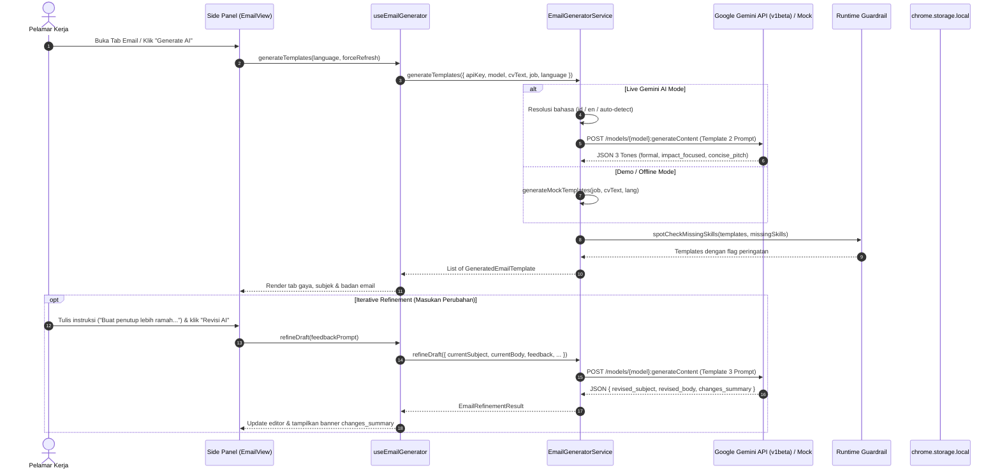

# Feature Documentation: Personalized Email Generator, Multi-Language & Iterative Refinement
## Milestone 5: Objective 5.1

Dokumen teknis ini menjelaskan arsitektur pembuatan email lamaran kerja berbasis AI (*Executive Career Pitch Writer*), dukungan multi-bahasa (*Indonesian, English, Auto-detect*), mekanisme penyesuaian iteratif (*iterative refinement* berbasis masukan pengguna), serta aturan verifikasi anti-halusinasi pasca-generasi (*runtime guardrail spot-check*).

---

## 1. Arsitektur & Alur Kerja

---

## 2. Fitur Utama

### 2.1 Multi-Tone Template Generation
AI menghasilkan 3 opsi gaya komunikasi profesional secara sekaligus:
1. **Formal & Professional (`formal`)**:
   - Bahasa baku, terstruktur rapi, menggunakan etika korespondensi formal.
   - Cocok untuk perusahaan multinasional, institusi perbankan/BUMN, atau korporat tradisional.
2. **Impact & Project-Focused (`impact_focused`)**:
   - Berorientasi pada pencapaian proyek nyata dan metrik kuantitatif dari CV (misal: persentase peningkatan performa web, jumlah pengguna aktif).
   - Cocok untuk startup, scale-up, atau tim produk digital berkecepatan tinggi.
3. **Concise Pitch (`concise_pitch`)**:
   - Ringkas dan padat (di bawah 150 kata).
   - Langsung menonjolkan kualifikasi utama untuk menarik perhatian recruiter / talent acquisition secara instan.

### 2.2 Multi-Language Support
Pengguna dapat memilih bahasa email melalui navigasi pill tombol di bagian atas:
- **Bahasa Indonesia (`id`)**: Menggunakan tata bahasa formal baku Indonesia (*Yth. Tim Rekrutmen*, salam penutup *Hormat saya*).
- **English (`en`)**: Standar korespondensi bisnis global (*Dear Hiring Team*, *Warm regards*).
- **Auto (Mengikuti Lowongan) (`auto`)**: Sistem menganalisis teks judul dan deskripsi lowongan untuk mendeteksi bahasa dominan secara otomatis (`detectJobLanguage`).
- **Preservasi Istilah Teknis**: Istilah teknologi (*tech stack*) seperti "Vue 3", "TypeScript", "Micro-frontend", "CI/CD", dan "Frontend Engineer" dipertahankan tanpa translasi harfiah yang janggal.

Preferensi bahasa tersimpan otomatis di pengaturan lokal (`chrome.storage.local`).

### 2.3 Masukan Perubahan (Iterative AI Refinement)
Pengguna tidak perlu memulai dari awal jika ingin mengubah sebagian aspek draf:
- Pengguna dapat mengetikkan instruksi bebas di kolom masukan (contoh: *"Buat pembuka lebih santai dan sebutkan ketertarikan pada platform e-commerce"*).
- Disediakan tombol chip cepat (*Quick Chips*):
  - `+ Lebih Ramah`
  - `+ Tekankan Metrik`
  - `+ Ringkas Teks`
  - `+ Bahasa Inggris`
  - `+ Bahasa Indonesia`
- AI memperbarui teks secara terarah melalui prompt *Template 3* dan menampilkan ringkasan perubahan (*changes summary*).

### 2.4 Runtime Guardrail Anti-Halusinasi
Sistem melakukan verifikasi pasca-generasi (*post-generation spot check*):
- Memeriksa apakah teks subjek atau isi email menyebutkan keahlian yang tercatat di daftar `missing_skills` (kualifikasi lowongan yang tidak tercantum di CV).
- Jika terdeteksi, ekstensi menampilkan banner peringatan kuning:
  *"Peringatan Runtime Guardrail: Draf email memuat kualifikasi [X] yang sebelumnya teridentifikasi sebagai Skill Gap di luar CV Anda."*
- Pengguna tetap memiliki kendali penyuntingan manual 100% langsung di textarea.

---

## 3. Pengujian Otomatis (Automated Tests)

Fitur ini diuji secara komprehensif melalui Vitest (`npm test`):
- `tests/unit/email-generator.spec.ts`:
  - Pengujian deteksi bahasa lowongan kerja (`id` vs `en`).
  - Pengujian resolusi bahasa berdasarkan preferensi pengguna (`id`, `en`, `auto`).
  - Pengujian deteksi ungrounded missing skills dan peringatan guardrail.
  - Pengujian generasi mock templates 3 gaya dalam Bahasa Indonesia dan English.
  - Pengujian penerapan instruksi revisi iteratif (masukan perubahan).
  - Pengujian format request HTTP dan integrasi Gemini API (Template 2 & Template 3).
- `tests/unit/use-email-generator.spec.ts`:
  - Pengujian reaktivitas composable `useEmailGenerator`.
  - Pengujian perpindahan gaya komunikasi (*tone switching*).
  - Pengujian pembaruan draf melalui `refineDraft`.
