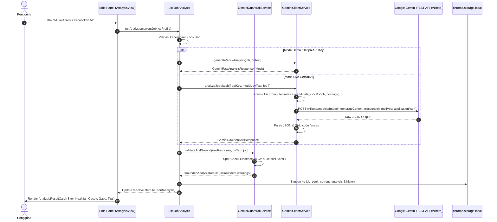

# Feature Documentation: Gemini AI Integration & Grounded Matching Engine
## Milestone 4: Objective 4.1 & 4.2

Dokumen teknis ini mendeskripsikan arsitektur pemanggilan Google Gemini API, mekanisme pembatasan konteks (*context boundary isolation*), validasi instan API key, penanganan batas kuota (*rate limiting & quota reset*), aturan nol halusinasi (*zero-hallucination runtime guardrail*), serta representasi visual hasil evaluasi kecocokan kandidat terhadap lowongan kerja.

---

## 1. Arsitektur & Alur Data



---

## 2. Komponen & Layanan Inti

### 2.1 Gemini Client Service (`src/services/geminiClient.ts`)
* **Endpoint Base**: `https://generativelanguage.googleapis.com/v1beta`
* **Endpoint Base**: `https://generativelanguage.googleapis.com/v1beta`
* **Penemuan Model Dinamis (`ModelService.ListModels`)**:
  - Model tidak lagi dibatasi secara hardcoded, melainkan diambil secara dinamis dari endpoint `GET /v1beta/models?key=...`.
  - Hanya model yang memiliki `supportedGenerationMethods: ["generateContent"]` yang dimasukkan ke dalam daftar pilihan.
  - Model diurutkan berdasarkan kapabilitas (Flash models versi terbaru seperti `gemini-2.0-flash`, `gemini-2.5-flash`, `gemini-1.5-flash-latest`, diikuti varian Pro).
* **Fitur Utama**:
  1. `listModels(apiKey: string)`:
     - Memanggil `ModelService.ListModels` resmi dari Google AI Studio.
     - Memfilter model teks/multimodal aktif dan mengeliminasi model embedding/non-generateContent.
  2. `validateApiKey(apiKey: string)`:
     - Melakukan kueri ringan ke endpoint `/models?key=...` untuk memvalidasi otorisasi API key secara langsung tanpa membakar kuota token generasi.
     - Menyimpan dan menyinkronkan daftar model yang valid ke pengaturan ekstensi.
  3. `analyzeJobMatch(options)`:
     - Membungkus teks CV kandidat dan teks lowongan dalam tag XML isolasi eksplisit:
       - `<candidate_cv>...</candidate_cv>`
       - `<job_posting>...</job_posting>`
     - Mengirimkan instruksi sistem berbasis *Template 1* dari `plans/AI_ASSISTANT_GUARDRAILS.md`.
     - Mengonfigurasi `temperature: 0.1` (sangat deterministik) dan `responseMimeType: "application/json"`.
     - **Auto-Fallback Recovery**: Jika model yang dikonfigurasi menghasilkan status 404 atau pesan *"is not found for API version v1beta, or is not supported for generateContent"*, sistem secara otomatis memanggil `listModels()`, memilih model aktif terbaik yang tersedia di akun pengguna (misal `gemini-2.0-flash`), dan mengulang pemanggilan secara transparan tanpa menghentikan proses pengguna.
  4. `parseJsonResponse(rawText: string)`:
     - Membersihkan markdown code fences (```json ... ```) secara aman sebelum parsing JSON.
  5. `generateMockAnalysis(job, cvText)`:
     - Menghasilkan respon analisis realistis berbasis kata kunci nyata di CV pengguna untuk mode simulasi offline (Demo Mode).

---

### 2.2 Runtime Guardrail Service (`src/services/geminiGuardrail.ts`)
Menjalankan verifikasi keamanan dan integritas data pasca-generasi (*post-generation*):
1. **Keyword Spot-check**:
   - Memindai setiap item dalam `matched_skills` beserta `cv_evidence` terhadap teks mentah CV kandidat menggunakan pencarian teks langsung dan *fuzzy keyword matching*.
   - Jika AI mengklaim keahlian yang tidak terdapat bukti di CV, sistem memberikan flag peringatan (*Hallucination Warning*) dan menandai `isGrounded = false`.
2. **Pemeriksaan Konflik Kualifikasi**:
   - Memastikan tidak ada keahlian yang tercantum di `missing_skills` (area kesenjangan) namun secara keliru juga diklaim di `matched_skills`.
3. **Validasi & Clamping Skor Relevansi**:
   - Menjamin nilai skor selalu berada di rentang integer 0–100.
   - Menyelaraskan kategori kecocokan (`High` untuk skor >= 75%, `Moderate` untuk 50–74%, `Low` untuk < 50%).

---

### 2.3 Penanganan Batas Kuota (*Rate Limit & Quota Reset*)
Pada paket Google AI Studio free-tier:
* Batas laju pemanggilan adalah **15 requests per minute (RPM)**.
* Kuota harian (RPD) di-reset otomatis setiap tengah malam waktu Pacific (*Midnight PT*).
* **Mekanisme Penanganan**:
  1. Jika server mengembalikan HTTP 429 (`Resource Exhausted / Rate Limit`), sistem melempar `GeminiClientError` dengan `isRateLimit: true`.
  2. Composable `useJobAnalysis` otomatis mengaktifkan **cooldown timer hitung mundur 45 detik** yang tampil langsung pada UI banner.
  3. Pengguna disajikan opsi cepat untuk beralih ke **Mode Demo** tanpa hambatan jeda waktu.

---

## 3. Integrasi Antarmuka Pengguna (UI)

### 3.1 Tab Pengaturan (`SettingsView.vue`)
* Input API Key aman yang tersimpan secara lokal di `chrome.storage.local`.
* Tombol **"Uji Koneksi API Key"**:
  - Memberikan feedback visual instan (hijau jika berhasil dengan daftar model aktif, merah jika kunci salah/dibatasi).
* Dropdown pemilihan model (`gemini-1.5-flash`, `gemini-2.0-flash`, `gemini-1.5-pro`).
* Toggle **"Mode Simulasi Gemini AI (Demo Mode)"** untuk demonstrasi tanpa kunci API.

### 3.2 Tab Analisa Lowongan (`AnalysisView.vue` & `AnalysisResultCard.vue`)
* Pengecekan prasyarat lengkap sebelum analisis:
  - Indikator status CV (siap / belum dipilih).
  - Indikator status Lowongan (siap / belum ada).
  - Indikator status Gemini API Key (aktif / belum diisi).
* Komponen visual **`AnalysisResultCard`**:
  - **Score Dial Card**: Menampilkan persentase kecocokan dengan warna dinamis (Hijau / Kuning / Merah).
  - **Ringkasan Kesesuaian**: Ringkasan eksekutif 2-3 kalimat.
  - **Matched Skills**: Daftar keahlian yang cocok beserta kutipan bukti asli dari CV (`cv_evidence`).
  - **Skill Gaps**: Kualifikasi yang belum terpenuhi, diklasifikasikan sebagai *Wajib (Crucial)* atau *Nilai Tambah (Preferred)* beserta rekomendasi transferable skills.
  - **Interview Highlights**: Poin pengalaman terkuat kandidat untuk sesi wawancara.
  - **Action Controls**: Tombol navigasi langsung ke pembuatan draft email lamaran (Milestone 5), tombol analisis ulang, dan tombol hapus hasil.

---

## 4. Pengujian Otomatis (Automated Tests)

Rangkaian pengujian diintegrasikan di Vitest (`npm test`):
* `tests/unit/gemini-client.spec.ts`:
  - Pengujian validasi API key (sukses, kunci tidak valid, rate limit, timeout).
  - Pengujian isolasi prompt dan format request HTTP.
  - Pengujian pembersihan markdown block wrapper JSON.
  - Pengujian generator mock response.
* `tests/unit/gemini-guardrail.spec.ts`:
  - Pengujian grounding spot-check terhadap teks CV.
  - Pengujian deteksi halusinasi keahlian asing.
  - Pengujian deteksi konflik antara matched skills dan missing skills.
  - Pengujian batas skor 0–100 dan normalisasi level.
* `tests/unit/job-analysis.spec.ts`:
  - Pengujian reaktivitas composable `useJobAnalysis`.
  - Pengujian penyimpanan hasil analisis dan riwayat ke `chrome.storage.local`.
  - Pengujian mekanisme pembersihan hasil (*clear analysis*).
