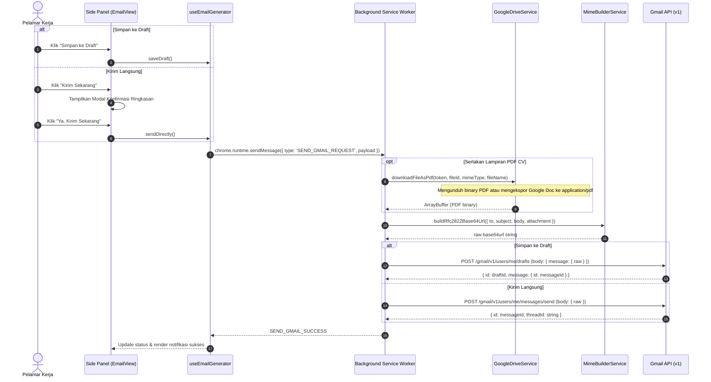

# Feature Documentation: Gmail Dispatch (Draft vs Direct Send via Gmail API)
## Milestone 5: Objective 5.2

Dokumen teknis ini mendeskripsikan implementasi pengiriman email lamaran melalui Gmail API, utilitas pembentuk pesan MIME RFC 2822 base64url-encoded, mekanisme lampiran CV asli dari Google Drive sebagai PDF, serta alur konfirmasi pengiriman langsung.

---

## 1. Arsitektur & Alur Pengiriman



---

## 2. Komponen & Layanan Inti

### 2.1 MimeBuilderService (`src/services/mimeBuilder.ts`)
Mengonstruksi pesan email berstandar RFC 2822 yang aman untuk karakter internasional (UTF-8) dan lampiran biner:
* **Subject Line Encoding (RFC 2047)**:
  - Subjek dibungkus dalam format `=?UTF-8?B?<base64>?=` sehingga karakter khusus (tanda pisah em-dash, aksen, huruf non-latin) tidak rusak di klien email penerima.
* **Email Tanpa Lampiran**:
  - Menghasilkan pesan `text/plain; charset="UTF-8"` dengan header `Content-Transfer-Encoding: 8bit`.
* **Email dengan Lampiran (Multipart/Mixed)**:
  - Menggunakan boundary unik dinamis (`boundary_job_seek_<timestamp>_<rand>`).
  - Menyematkan biner lampiran dalam `Content-Type: application/pdf` dan `Content-Disposition: attachment; filename="..."` dengan chunking 76 karakter per baris sesuai spesifikasi RFC 2045.
* **URL-Safe Base64 Encoding**:
  - Mengonversi teks MIME mentah menjadi string base64url standar RFC 4648 (`+` menjadi `-`, `/` menjadi `_`, dan membuang padding `=`) untuk dikonsumsi oleh endpoint Gmail API `raw`.

### 2.2 Google Drive PDF Attachment Downloader (`src/services/googleDrive.ts`)
Metode `GoogleDriveService.downloadFileAsPdf`:
* Jika file CV bertipe **Google Docs** (`application/vnd.google-apps.document`):
  - Memanggil endpoint export Drive API: `GET /drive/v3/files/{id}/export?mimeType=application/pdf` untuk mengonversi dokumen Google Docs menjadi format PDF secara *on-the-fly*.
* Jika file CV bertipe **PDF** (`application/pdf`):
  - Mengunduh biner langsung via `GET /drive/v3/files/{id}?alt=media`.
* Di Mode Demo:
  - Menyediakan buffer biner PDF valid berukuran ringan tanpa memerlukan kredensial Google Drive aktif.

### 2.3 Gmail Client Service (`src/services/gmailClient.ts`)
* `createDraft(token, rawBase64Url)`:
  - Memanggil endpoint `POST https://gmail.googleapis.com/gmail/v1/users/me/drafts`.
  - Mengembalikan `draftId` dan `messageId`.
* `sendMessage(token, rawBase64Url)`:
  - Memanggil endpoint `POST https://gmail.googleapis.com/gmail/v1/users/me/messages/send`.
  - Mengembalikan `messageId` dan `threadId`.
* **Penanganan Error & Auto-Refresh Token**:
  - Mengklasifikasikan error HTTP 401 (token kedaluwarsa) dan HTTP 403 (kekurangan izin scope).
  - Background worker secara otomatis menginvalidasi token lama dan meminta token baru dari `GoogleAuthService` lalu mengulang request sekali secara transparan.

### 2.4 Modal Konfirmasi Pengiriman Langsung (Security Guard)
Untuk mencegah pengiriman email yang tidak disengaja (*accidental dispatch*):
* Menampilkan modal dialog yang merangkum:
  - Alamat email penerima.
  - Subjek email.
  - Status lampiran CV dari Google Drive.
  - Peringatan bahwa email akan langsung dikirim dari akun Gmail pengguna.
* Pengguna dapat membatalkan atau menyetujui pengiriman secara eksplisit.

---

## 3. Konfigurasi Manifest & Scope Google OAuth

Pada `manifest.config.ts`:
```typescript
host_permissions: [
  'https://generativelanguage.googleapis.com/*',
  'https://gmail.googleapis.com/*',
  'https://www.googleapis.com/*',
],
oauth2: {
  client_id: '439773286903-pjobseekassistantclient.apps.googleusercontent.com',
  scopes: [
    'https://www.googleapis.com/auth/drive.readonly',
    'https://www.googleapis.com/auth/userinfo.email',
    'https://www.googleapis.com/auth/userinfo.profile',
    'https://www.googleapis.com/auth/gmail.compose',
    'https://www.googleapis.com/auth/gmail.send',
  ],
}
```

---

## 4. Pengujian Otomatis (Automated Tests)

Rangkaian pengujian terintegrasi di Vitest:
* `tests/unit/mime-builder.spec.ts`:
  - Pengujian base64url encoder (bebas dari karakter `+`, `/`, `=`).
  - Pengujian pembentukan header RFC 2047 UTF-8.
  - Pengujian struktur RFC 2822 plain text tanpa lampiran.
  - Pengujian struktur multipart/mixed dengan biner PDF lampiran.
  - Pengujian kesesuaian output base64url untuk payload Gmail API.
* `tests/unit/gmail-client.spec.ts`:
  - Pengujian pemanggilan endpoint `drafts.create`.
  - Pengujian pemanggilan endpoint `messages.send`.
  - Pengujian simulasi Mode Demo tanpa pemanggilan jaringan eksternal.
  - Pengujian penanganan error status 401 dan 403.
