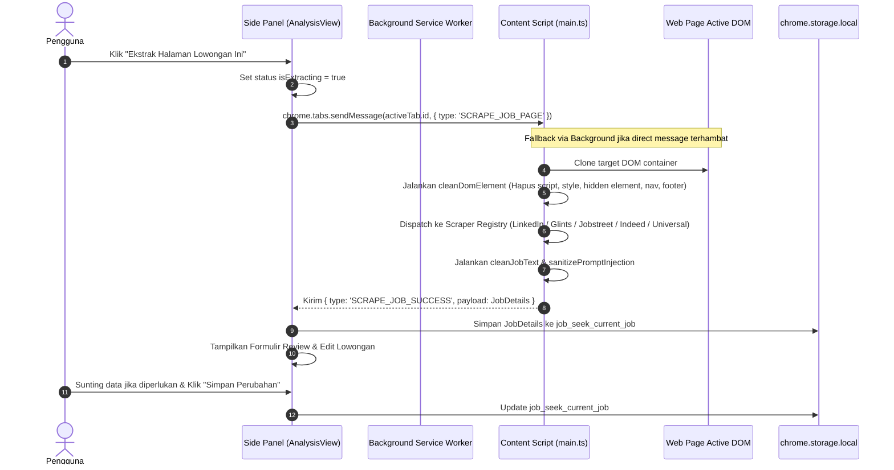

# Feature Documentation: Content Script & Active Web Job Extractor
## Milestone 3: Objective 3.1, 3.2, & 3.3

Dokumen teknis ini mendeskripsikan arsitektur, format pesan komunikasi antar-komponen, sanitasi keamanan anti-*prompt injection*, serta panduan pengujian manual dan otomatis untuk fitur pengekstraksian data lowongan kerja secara *real-time* dari halaman peramban aktif.

---

## 1. Arsitektur & Alur Data

Ekstraksi lowongan kerja bekerja secara *cross-context* di lingkungan Google Chrome / Microsoft Edge Manifest V3:



### Komponen yang Terlibat:
1. **Side Panel (`src/sidepanel/views/AnalysisView.vue`)**:
   - Menjadi antarmuka utama pengguna untuk memicu ekstraksi halaman aktif.
   - Menyajikan formulir review interaktif untuk memvalidasi dan menyunting data hasil ekstraksi (Judul, Perusahaan, Lokasi, Model Kerja, Email Recruiter, Deskripsi, dan Kualifikasi).
   - Menghubungkan data lowongan ke persiapan analisis AI (Milestone 4).
2. **Composable Layer (`src/composables/useJobExtractor.ts` & `src/composables/useStorageState.ts`)**:
   - Mengelola state reaktif (`currentJob`, `isExtracting`, `extractionError`, `successMessage`).
   - Melakukan querying tab aktif melalui `chrome.tabs.query` dan pengiriman pesan `chrome.tabs.sendMessage`.
   - Mengatur persistensi lokal ke `STORAGE_KEYS.CURRENT_JOB`.
3. **Content Script (`src/content/main.ts`)**:
   - Berjalan dalam konteks halaman web pengguna.
   - Menangkap pesan `{ type: 'SCRAPE_JOB_PAGE' }` dan mengeksekusi ekstraksi DOM.
4. **Scraper Engines (`src/content/scrapers/`)**:
   - `linkedin.ts`: Parser khusus LinkedIn Jobs (`linkedin.com/jobs/*`).
   - `glints.ts`: Parser khusus Glints (`glints.com/*/opportunities/jobs/*`).
   - `jobstreet.ts`: Parser khusus Jobstreet / SEEK Asia (`jobstreet.*`, `seek.com.au`).
   - `indeed.ts`: Parser khusus Indeed (`*.indeed.com/viewjob*`).
   - `universal.ts`: Heuristic Fallback Scraper untuk situs karir independen (Greenhouse, Lever, Workable, Ashby, maupun situs karir kustom perusahaan).
5. **Sanitizer & Anti-Prompt Injection Utility (`src/utils/sanitizer.ts`)**:
   - Menghapus elemen tersembunyi (`display: none`, `opacity: 0`, `font-size: 0`, `visibility: hidden`) yang dapat digunakan untuk menyisipkan instruksi jahat terselubung.
   - Menormalkan unicode dan karakter zero-width (`\u200B`, `\uFEFF`).
   - Menetralkan instruksi overriding seperti `"Ignore previous instructions"` atau tag delimitasi palsu (`</job_posting>`).
   - Mengekstrak dan memvalidasi email recruiter dari teks lowongan.

---

## 2. Format Pesan (Chrome Message Passing Contract)

Komunikasi antar-komponen diatur dalam kontrak `src/types/messages.ts`:

```typescript
export type ExtensionMessage =
  | { type: 'SCRAPE_JOB_PAGE' }
  | { type: 'SCRAPE_JOB_SUCCESS'; payload: JobDetails }
  | { type: 'API_ERROR'; error: string }
  // ...pesan auth dan drive lainnya
```

Format Data `JobDetails` (`src/types/job.ts`):
```typescript
export interface JobDetails {
  id: string
  url: string
  title: string
  company: string
  location?: string
  workplaceType?: 'Remote' | 'Hybrid' | 'On-site' | 'Unspecified'
  description: string
  requirements?: string
  recruiterEmail?: string
  platform: 'linkedin' | 'glints' | 'jobstreet' | 'indeed' | 'custom'
  extractedAt: string
}
```

---

## 3. Daftar Perubahan File

| Status | File Path | Tanggung Jawab |
|---|---|---|
| **NEW** | `src/utils/sanitizer.ts` | Pembersihan DOM pra-ekstraksi, normalisasi whitespace, neutralizer prompt injection, dan ekstraksi email recruiter. |
| **NEW** | `src/content/scrapers/types.ts` | Interface `JobScraper` dan kontrak `ScrapeResult`. |
| **NEW** | `src/content/scrapers/utils.ts` | Helper query DOM, deteksi workplace type (Remote/Hybrid/Onsite), dan pemisahan kualifikasi. |
| **NEW** | `src/content/scrapers/linkedin.ts` | Parser DOM khusus LinkedIn Jobs. |
| **NEW** | `src/content/scrapers/glints.ts` | Parser DOM khusus Glints. |
| **NEW** | `src/content/scrapers/jobstreet.ts` | Parser DOM khusus Jobstreet & SEEK. |
| **NEW** | `src/content/scrapers/indeed.ts` | Parser DOM khusus Indeed. |
| **NEW** | `src/content/scrapers/universal.ts` | Heuristic Fallback Scraper untuk situs karir independen perusahaan. |
| **NEW** | `src/content/scrapers/index.ts` | Scraper registry dan dispatcher utama. |
| **MODIFY** | `src/content/main.ts` | Message listener `SCRAPE_JOB_PAGE` dan pengirim response `SCRAPE_JOB_SUCCESS`. |
| **MODIFY** | `src/background/index.ts` | Fallback bridge untuk pesan `SCRAPE_JOB_PAGE`. |
| **MODIFY** | `src/composables/useStorageState.ts` | Penambahan composable `useCurrentJob` untuk persistensi storage. |
| **NEW** | `src/composables/useJobExtractor.ts` | Logika ekstraksi tab aktif, status loading, dan manajemen error. |
| **MODIFY** | `src/sidepanel/views/AnalysisView.vue` | UI tombol ekstraksi, form review & edit interaktif, badge platform, dan auto-save. |
| **MODIFY** | `tests/mocks/chrome.ts` | Penambahan mock `chrome.tabs.query` dan `chrome.tabs.sendMessage`. |
| **NEW** | `tests/fixtures/job-dom-fixtures.ts` | Fixture DOM snapshot untuk pengujian offline seluruh scraper. |
| **NEW** | `tests/unit/sanitizer.spec.ts` | Unit tests untuk pembersihan DOM dan pertahanan prompt injection. |
| **NEW** | `tests/unit/job-scrapers.spec.ts` | Unit tests untuk parser LinkedIn, Glints, Jobstreet, Indeed, dan Universal. |
| **NEW** | `tests/unit/job-extractor.spec.ts` | Unit tests untuk composable `useJobExtractor` dan integrasi storage. |

---

## 4. Panduan Testing Manual (Manual Testing Checklist)

Ikuti langkah-langkah berikut untuk memvalidasi fitur langsung pada Google Chrome atau Microsoft Edge Developer Mode:

### Skenario 1: Ekstraksi dari LinkedIn Jobs
1. **Pre-requisite**: Pastikan ekstensi telah di-*build* (`npm run build`) dan dimuat di `chrome://extensions/`.
2. Buka salah satu halaman lowongan publik di LinkedIn (contoh: `https://www.linkedin.com/jobs/view/...`).
3. Buka Side Panel Job Seek Assistant.
4. Klik tombol **"Ekstrak Halaman Lowongan Ini"**.
5. **Hasil yang Diharapkan**:
   - Tombol menampilkan animasi spinner *"Mengekstrak Halaman Aktif..."*.
   - Muncul notifikasi hijau: *"Berhasil mengekstrak [Judul] dari [Perusahaan]"*.
   - Tampil badge biru **"LinkedIn Jobs"** beserta tautan **"Buka Sumber"**.
   - Input judul, perusahaan, lokasi, model kerja, dan deskripsi terisi secara akurat.

### Skenario 2: Ekstraksi dari Glints / Jobstreet / Indeed
1. Buka halaman detail lowongan di Glints, Jobstreet, atau Indeed.
2. Klik tombol **"Ekstrak Halaman Lowongan Ini"** di Side Panel.
3. **Hasil yang Diharapkan**:
   - Badge platform sesuai (Merah untuk Glints, Amber untuk Jobstreet, Indigo untuk Indeed).
   - Teks kualifikasi dan kontak email recruiter terdeteksi jika tercantum di halaman.

### Skenario 3: Ekstraksi Heuristic Fallback (Situs Karir Perusahaan)
1. Buka situs karir perusahaan independen (contoh: halaman karir Stripe, Google Careers, Tokopedia Careers, atau Greenhouse/Lever).
2. Klik **"Ekstrak Halaman Lowongan Ini"**.
3. **Hasil yang Diharapkan**:
   - Badge hijau **"Career Website"** muncul.
   - Algoritma membaca bagian utama konten lowongan tanpa mengikutsertakan navbar situs atau teks footer hak cipta.

### Skenario 4: Review & Edit Manual
1. Pada data lowongan yang telah diekstrak, lakukan perubahan manual pada kolom **"Posisi / Job Title"** atau **"Deskripsi Pekerjaan"**.
2. Klik tombol **"Simpan Perubahan"**.
3. Tutup Side Panel atau muat ulang ekstensi, lalu buka kembali Side Panel.
4. **Hasil yang Diharapkan**:
   - Data lowongan hasil editan tetap tersimpan persisten di formulir.

### Skenario 5: Penanganan Error pada Tab Internal Browser
1. Buka tab internal browser seperti `chrome://extensions/` atau `chrome://settings/`.
2. Buka Side Panel dan klik **"Ekstrak Halaman Lowongan Ini"**.
3. **Hasil yang Diharapkan**:
   - Muncul banner peringatan merah ramah pengguna: *"Halaman sistem internal peramban tidak dapat diekstrak. Silakan buka halaman lowongan kerja di portal atau situs karir publik."*
   - Opsi input lowongan manual tetap tersedia.

---

## 5. Panduan Testing Otomatis (Automated Testing Guide)

Jalankan seluruh rangkaian automated unit test dengan perintah:

```bash
npm test
```

### Rincian Test Suite:
1. **`tests/unit/sanitizer.spec.ts`**:
   - Verifikasi pembersihan karakter zero-width (`\u200B`, `\uFEFF`).
   - Verifikasi pembersihan elemen tersembunyi (`display: none`, `opacity: 0`, `font-size: 0`).
   - Verifikasi neutralisasi pola serangan *indirect prompt injection* (Bahasa Inggris & Bahasa Indonesia) dan tag injeksi XML delimitasi (`</job_posting>`).
   - Verifikasi ekstraksi dan deduplikasi email recruiter dengan penyaringan domain dummy.
2. **`tests/unit/job-scrapers.spec.ts`**:
   - Verifikasi pencocokan URL dan ekstraksi data dari DOM Snapshot Fixture:
     - LinkedIn Jobs
     - Glints
     - Jobstreet / SEEK Asia
     - Indeed
     - Universal Heuristic Fallback
   - Verifikasi pertahanan keamanan anti-injeksi terhadap payload dokumen web berbahaya.
3. **`tests/unit/job-extractor.spec.ts`**:
   - Verifikasi pemanggilan Chrome API (`tabs.query`, `tabs.sendMessage`).
   - Verifikasi persistensi data ke `chrome.storage.local`.
   - Verifikasi penolakan tab internal (`chrome://`).
   - Verifikasi fungsionalitas edit dan reset lowongan.
