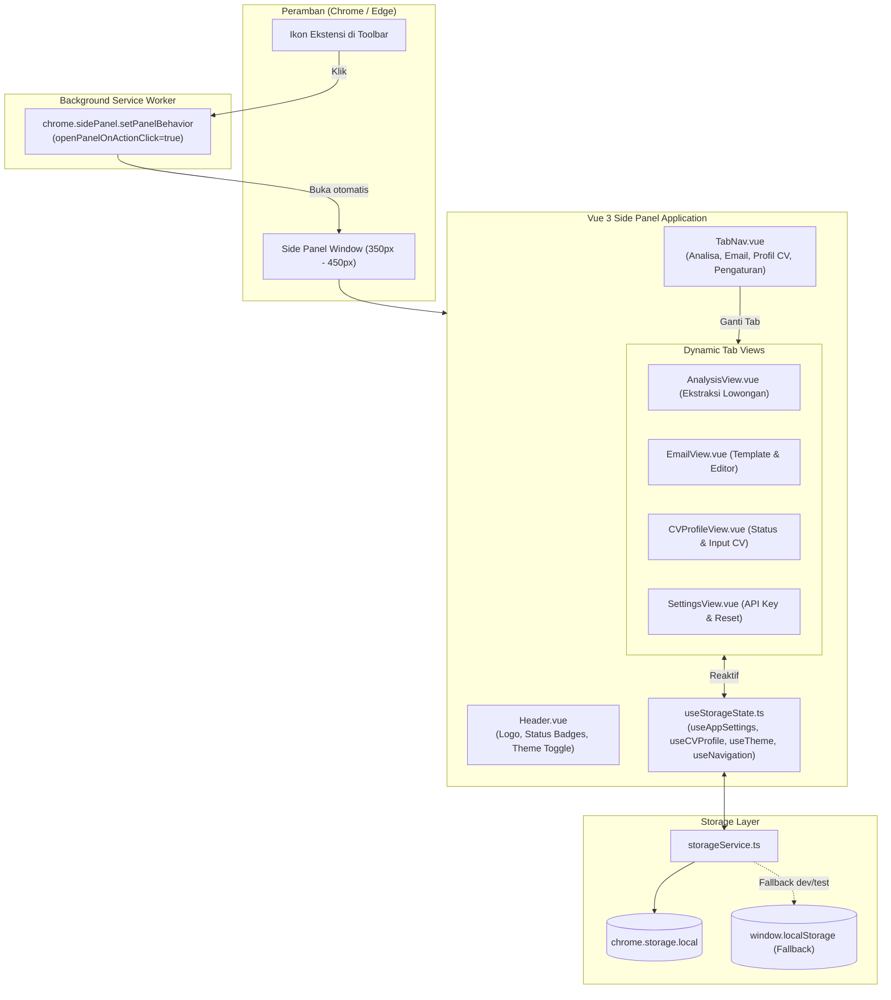

# Fitur: Side Panel UI & Local Storage Engine
## Milestone 1: Extension Foundation, UI Shell & State Infrastructure

Dokumen ini memuat detail arsitektur teknis, daftar berkas komponen, panduan pengujian otomatis, dan *manual testing checklist* untuk antarmuka Side Panel dan engine penyimpanan lokal Manifest V3.

---

### 1. Arsitektur & Alur Data

Antarmuka Side Panel berjalan sebagai konteks ekstensi independen yang terdaftar pada Chrome Manifest V3 melalui properti `side_panel` dan perizinan `sidePanel`.



#### Kontrak Komponen & State
* **`chrome.storage.local`**: Penyimpanan terenkripsi/terisolasi untuk data pengguna (`job_seek_settings`, `job_seek_cv_profile`, `job_seek_current_job`, dll).
* **`storageService`**: Abstraksi type-safe yang menangani serialisasi JSON, fallback transparan ke `window.localStorage` saat diuji coba di luar konteks ekstensi, dan event listener reaktif (`onChanged`).
* **`useStorageState`**: Singleton reactive state composables untuk sinkronisasi antarmuka Vue 3 tanpa perlunya polling manual.

---

### 2. Daftar Perubahan File

| Path File | Aksi | Tanggung Jawab |
|---|---|---|
| [`manifest.config.ts`](file:///D:/pribadi/Projects/job-seek-assistant/manifest.config.ts) | MODIFIKASI | Mendaftarkan `sidePanel`, `storage`, background service worker, dan action icon |
| [`package.json`](file:///D:/pribadi/Projects/job-seek-assistant/package.json) | MODIFIKASI | Menambahkan dependensi Tailwind CSS, Lucide icons, Vitest, dan scripts |
| [`tailwind.config.ts`](file:///D:/pribadi/Projects/job-seek-assistant/tailwind.config.ts) | BARU | Konfigurasi styling Tailwind CSS dengan dukungan mode gelap berbasis class (`dark`) |
| [`postcss.config.js`](file:///D:/pribadi/Projects/job-seek-assistant/postcss.config.js) | BARU | Integrasi PostCSS untuk Tailwind CSS dan Autoprefixer |
| [`vitest.config.ts`](file:///D:/pribadi/Projects/job-seek-assistant/vitest.config.ts) | BARU | Konfigurasi runner pengujian unit Vitest |
| [`src/background/index.ts`](file:///D:/pribadi/Projects/job-seek-assistant/src/background/index.ts) | BARU | Service worker Manifest V3 untuk aktivasi `openPanelOnActionClick` |
| [`src/types/`](file:///D:/pribadi/Projects/job-seek-assistant/src/types/) | BARU | Deklarasi antarmuka TypeScript (`cv.ts`, `job.ts`, `analysis.ts`, `email.ts`, `settings.ts`, `messages.ts`) |
| [`src/services/storage.ts`](file:///D:/pribadi/Projects/job-seek-assistant/src/services/storage.ts) | BARU | Wrapper type-safe `chrome.storage.local` dengan mekanisme fallback cerdas |
| [`src/composables/useStorageState.ts`](file:///D:/pribadi/Projects/job-seek-assistant/src/composables/useStorageState.ts) | BARU | Reaktif state composables (`useAppSettings`, `useCVProfile`, `useTheme`, `useNavigation`) |
| [`src/sidepanel/App.vue`](file:///D:/pribadi/Projects/job-seek-assistant/src/sidepanel/App.vue) | MODIFIKASI | Root layout side panel dengan keep-alive tab view switcher |
| [`src/sidepanel/style.css`](file:///D:/pribadi/Projects/job-seek-assistant/src/sidepanel/style.css) | MODIFIKASI | Direktif Tailwind CSS dan styling scrollbar kustom |
| [`src/sidepanel/components/Header.vue`](file:///D:/pribadi/Projects/job-seek-assistant/src/sidepanel/components/Header.vue) | BARU | Header atas dengan logo, status badges, dan tombol toggle tema |
| [`src/sidepanel/components/TabNav.vue`](file:///D:/pribadi/Projects/job-seek-assistant/src/sidepanel/components/TabNav.vue) | BARU | Navigasi 4 tab (Analisa, Email, Profil CV, Pengaturan) |
| [`src/sidepanel/views/AnalysisView.vue`](file:///D:/pribadi/Projects/job-seek-assistant/src/sidepanel/views/AnalysisView.vue) | BARU | Tampilan Tab 1: Ekstraksi lowongan dan placeholder analisis |
| [`src/sidepanel/views/EmailView.vue`](file:///D:/pribadi/Projects/job-seek-assistant/src/sidepanel/views/EmailView.vue) | BARU | Tampilan Tab 2: Pilihan 3 tone email dan inline editor |
| [`src/sidepanel/views/CVProfileView.vue`](file:///D:/pribadi/Projects/job-seek-assistant/src/sidepanel/views/CVProfileView.vue) | BARU | Tampilan Tab 3: Pratinjau data CV dan form input manual |
| [`src/sidepanel/views/SettingsView.vue`](file:///D:/pribadi/Projects/job-seek-assistant/src/sidepanel/views/SettingsView.vue) | BARU | Tampilan Tab 4: Pengaturan Gemini API Key, tema, dan reset data |
| [`tests/mocks/chrome.ts`](file:///D:/pribadi/Projects/job-seek-assistant/tests/mocks/chrome.ts) | BARU | In-memory mock lengkap untuk `chrome.storage.local` dan `chrome.runtime` |
| [`tests/unit/storage.spec.ts`](file:///D:/pribadi/Projects/job-seek-assistant/tests/unit/storage.spec.ts) | BARU | Pengujian unit storage service |
| [`tests/unit/sidepanel-tabs.spec.ts`](file:///D:/pribadi/Projects/job-seek-assistant/tests/unit/sidepanel-tabs.spec.ts) | BARU | Pengujian unit komponen navigasi tab dan header |

---

### 3. Panduan Pengujian Otomatis (Automated Testing Guide)

Untuk menjalankan seluruh rangkaian pengujian otomatis:
```bash
# Menjalankan pengujian unit Vitest (Single Run)
npm run test

# Menjalankan pengujian unit Vitest (Watch Mode)
npm run test:watch

# Memastikan build TypeScript dan Vite lulus tanpa error
npm run build
```

Cakupan pengujian:
* Verifikasi penyimpanan dan pembacaan objek kompleks (`CVProfile`, `AppSettings`).
* Verifikasi pembersihan (*clear*) dan penghapusan kunci individual.
* Verifikasi fallback otomatis ke `window.localStorage` bila `chrome` API tidak tersedia.
* Verifikasi rendering 4 tab navigasi dan reaksi pergantian tab.

---

### 4. Panduan Pengujian Manual (Manual Testing Checklist)

| No | Langkah Pengujian | Tindakan Penguji | Hasil yang Diharapkan | Status |
|---|---|---|---|:---:|
| 1 | Pemasangan Ekstensi | Buka `chrome://extensions/` -> Aktifkan Developer mode -> Klik *Load unpacked* -> Pilih folder `dist/` | Ekstensi "Job Seek Assistant" terpasang tanpa badge error merah. | [ ] |
| 2 | Pembukaan Side Panel | Klik ikon ekstensi Job Seek Assistant di toolbar peramban | Side Panel langsung terbuka di sebelah kanan browser secara mulus. | [ ] |
| 3 | Verifikasi 4 Tab | Klik masing-masing tombol tab: **Analisa**, **Email**, **Profil CV**, dan **Pengaturan** | Tampilan berganti sesuai tab aktif tanpa adanya error konsol JavaScript. | [ ] |
| 4 | Pengujian Toggle Tema | Klik tombol ikon Matahari/Bulan di header | Tampilan beralih antara Mode Terang (putih) dan Mode Gelap (abu-abu/hitam pekat) secara instan. | [ ] |
| 5 | Pengujian Input Manual CV | Di tab **Profil CV**, klik *Input / Paste CV Manual*, isi nama & ringkasan keahlian, lalu klik *Simpan CV* | Status berubah menjadi "CV Tersedia", badge header berubah menjadi biru/hijau, dan ringkasan tersimpan. | [ ] |
| 6 | Pengujian Gemini API Key | Di tab **Pengaturan**, masukkan API Key dummy (contoh: `AIzaSyDummyTest123`) lalu klik *Simpan Konfigurasi AI* | Pesan sukses muncul dan badge header berubah menjadi hijau ("AI Siap"). | [ ] |
| 7 | Persistensi Data (Tutup & Buka Ulang) | Tutup Side Panel (klik tombol X), lalu klik ikon ekstensi untuk membukanya kembali | Seluruh data CV dan API Key yang diisi sebelumnya tetap ada dan tidak hilang. | [ ] |
| 8 | Pengujian Reset Data | Di tab **Pengaturan**, klik *Reset Seluruh Penyimpanan Lokal* dan konfirmasi dialog | Seluruh data lokal dibersihkan kembali ke nilai default. | [ ] |
