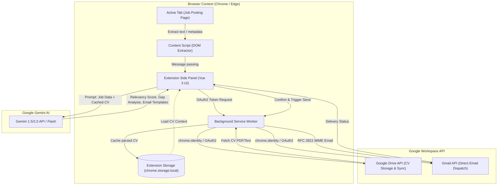

# Business Requirements Document (BRD)
## Project: Job Seek Assistant (Chrome & Edge Extension)

---

### 1. Executive Summary
**Job Seek Assistant** adalah ekstensi peramban (Chrome dan Microsoft Edge berbasis Chromium) berbasis Manifest V3 yang dirancang untuk mempercepat dan mengoptimalkan proses pencarian kerja bagi para profesional. Ekstensi ini berperan sebagai asisten cerdas pribadi yang mengintegrasikan data pengguna dari **Google Workspace** (Google Drive untuk penyimpanan dan sinkronisasi CV, serta Gmail untuk pengiriman lamaran) dengan kapabilitas penalaran dari **Google Gemini AI**.

Ekstensi ini mampu membaca dan mengekstrak rincian lowongan kerja secara langsung dari halaman aktif di browser (seperti LinkedIn, Glints, Jobstreet, Indeed, atau situs karir perusahaan), mencocokkannya dengan CV pengguna, menyajikan analisis relevansi secara objektif dan mendalam, menyusun draf email lamaran yang dipersonalisasi, serta mengirimkan email tersebut langsung melalui integrasi Gmail API tanpa mengharuskan pengguna membuka tab email secara manual.

---

### 2. Business Objectives & Value Proposition
* **Efisiensi Waktu**: Mengurangi waktu yang dihabiskan untuk membaca deskripsi pekerjaan yang panjang dan menyusun email lamaran dari rata-rata 15–30 menit menjadi kurang dari 2 menit per lowongan.
* **Akurasi & Personalisasi**: Menghilangkan kesalahan umum dalam melamar pekerjaan (salah menyebutkan nama perusahaan/posisi, melamar ke posisi yang tidak sesuai kualifikasi) melalui analisis berbasis kecerdasan buatan yang berakar kuat pada fakta CV asli pengguna.
* **Privasi & Keamanan Data**: Data sensitif (CV, token otentikasi, catatan pelamar) disimpan secara aman di penyimpanan lokal peramban (`chrome.storage.local`) dan Google Drive pengguna sendiri tanpa perantara server pihak ketiga yang tidak tepercaya (*bring-your-own-cloud/zero-vendor-storage*).
* **Pencegahan Halusinasi AI**: Memastikan AI tidak pernah mengarang keterampilan (*skills*), sertifikasi, atau pengalaman kerja yang tidak tercantum dalam riwayat resmi pengguna.

---

### 3. Stakeholder & User Personas
* **Active Job Seeker**: Pelamar kerja aktif yang mengirimkan banyak lamaran setiap hari dan membutuhkan ringkasan relevansi instan serta draft email cepat.
* **Passive / Selective Job Seeker**: Profesional yang selektif dan ingin mengetahui kecocokan teknis mendalam (gap analysis) sebelum memutuskan untuk melamar.
* **Career Switcher**: Individu yang ingin melihat keterampilan mana yang dapat ditransfer (*transferable skills*) dan area mana yang memerlukan penyesuaian pada draf email lamaran.

---

### 4. High-Level Architecture & Data Flow

---

### 5. Functional Requirements (FR)

#### FR-1: Google Workspace Authentication & Permissions
* **FR-1.1**: Ekstensi harus mendukung otentikasi OAuth 2.0 melalui `chrome.identity.getAuthToken` atau `chrome.identity.launchWebAuthFlow`.
* **FR-1.2**: Lingkup perizinan (*scopes*) yang diminta harus menganut prinsip *least privilege*:
  * `https://www.googleapis.com/auth/drive.readonly` (untuk membaca dokumen CV dari Google Drive).
  * `https://www.googleapis.com/auth/gmail.send` atau `https://www.googleapis.com/auth/gmail.compose` (untuk mengirim atau membuat draf email langsung).
* **FR-1.3**: Ekstensi harus menampilkan status koneksi Google Workspace (Terhubung / Belum Terhubung) beserta tombol *Connect / Disconnect*.

#### FR-2: CV Ingestion, Parsing & Local Memory Sync
* **FR-2.1**: Pengguna dapat memilih file CV dari Google Drive melalui Drive Picker atau integrasi file selector.
* **FR-2.2**: Ekstensi mendukung pembacaan dokumen CV berformat **PDF** (ekstraksi via engine PDF parser) dan **Google Docs** (ekstraksi via export API `text/plain`), mengekstrak teks lengkap, serta memformatnya menjadi struktur data standar (profil, riwayat kerja, pendidikan, keterampilan, proyek).
* **FR-2.3**: Dokumen CV yang telah diekstrak disimpan dalam memori lokal ekstensi (`chrome.storage.local`) agar dapat digunakan secara instan tanpa perlu memanggil Google Drive API berulang kali.
* **FR-2.4**: Ekstensi menyediakan mekanisme sinkronisasi/pembaruan (Update CV):
  * Pengguna dapat menekan tombol **"Sync / Refresh CV"**.
  * Sistem mengecek `modifiedTime` atau hash file di Google Drive. Jika ada perubahan, ekstensi memperbarui memori lokal secara otomatis.

#### FR-3: Active Tab Job Extraction (Content Script)
* **FR-3.1**: Ekstensi harus dapat mengekstrak teks dan informasi penting dari halaman lowongan kerja yang sedang dibuka, meliputi:
  * Judul Pekerjaan (*Job Title*)
  * Nama Perusahaan (*Company Name*)
  * Lokasi / Status Kerja (*Remote / Hybrid / On-site*)
  * Uraian Tanggung Jawab (*Job Description & Responsibilities*)
  * Persyaratan & Kualifikasi (*Requirements & Qualifications*)
  * Kontak / Email Recruiter (jika tertera di halaman)
* **FR-3.2**: Ekstensi mendukung *smart parsers* untuk platform populer (LinkedIn Jobs, Glints, Jobstreet, Indeed, Kalibrr) serta *fallback heuristic reader* (ekstraksi konten utama menggunakan algoritma readability) untuk portal karir internal perusahaan apa pun.
* **FR-3.3**: Pengguna dapat melihat pratinjau teks yang berhasil diekstrak dan memiliki opsi untuk mengedit atau menambahkan catatan secara manual sebelum analisis dijalankan.

#### FR-4: AI-Powered Job Match & Gap Analysis
* **FR-4.1**: Ekstensi mengirimkan data lowongan pekerjaan dan data CV lokal ke Gemini AI dengan instruksi sistem terpandu (*grounded system prompt*).
* **FR-4.2**: Output analisis AI wajib mencakup:
  * **Skor Relevansi**: Persentase kecocokan (0–100%).
  * **Summary Match**: Penjelasan ringkas mengapa kandidat cocok untuk posisi tersebut.
  * **Matched Skills**: Keterampilan dan pengalaman pengguna yang relevan dengan kebutuhan lowongan.
  * **Skill & Experience Gaps**: Kualifikasi yang diminta lowongan namun belum tercantum dalam CV pengguna (secara objektif, tanpa menyudutkan).
  * **Rekomendasi Strategis**: Tips penekanan portofolio saat wawancara atau tindak lanjut.
* **FR-4.3**: Penegakan aturan anti-halusinasi (*Strict Grounding*): AI dilarang keras berasumsi atau mengarang pengalaman yang tidak ada di CV.

#### FR-5: Personalized Email Subject & Body Generation & Iterative Refinement
* **FR-5.1**: Ekstensi menyediakan generator draf email lamaran/kontak recruiter berdasarkan hasil analisis lowongan dan CV.
* **FR-5.2**: Ekstensi menyediakan minimal 3 variasi *template / tone*:
  * **Formal & Professional**: Cocok untuk korporat, BUMN, atau institusi tradisional.
  * **Dynamic & Project-Centric**: Menyorot pencapaian dan proyek spesifik yang relevan; cocok untuk startup atau tech companies.
  * **Direct & Concise Pitch**: Email singkat dan padat untuk dikirimkan langsung ke Headhunter / Talent Acquisition Lead.
* **FR-5.3**: Setiap rekomendasi email harus menyertakan **Subject Line** yang menarik dan relevan serta **Body Text** yang terstruktur rapi dengan *placeholder* otomatis (Nama Recruiter, Nama Perusahaan, Tanggal, dll.).
* **FR-5.4 (Masukan Perubahan / Iterative AI Refinement)**: Pengguna dapat memberikan instruksi atau koreksi tambahan kepada AI (misal: "Buat pembuka lebih santai", "Tekankan pengalaman saya pada proyek e-commerce", dsb.) serta dapat menyunting langsung teks di editor sebelum melanjutkan.
* **FR-5.5 (Email Language Selection / Multi-Language Support)**:
  * Pengguna dapat memilih bahasa email yang akan digenerate: **Bahasa Indonesia**, **English**, atau **Auto (Mendeteksi dan mengikuti bahasa deskripsi lowongan kerja)**.
  * AI menyesuaikan subjek, tata bahasa formal/bisnis, salam pembuka (*salutation*), serta penutup (*sign-off*) sesuai konvensi bahasa yang dipilih, dengan tetap menjaga istilah teknis (*tech stack/skills*) tanpa terjemahan harfiah yang janggal.

#### FR-6: Email Dispatch Options (Draft vs Direct Send via Gmail API)
* **FR-6.1**: Pengguna dapat meninjau (*preview*) dan mengedit Subject, Alamat Penerima (*To*), serta Body Text sebelum dikirim.
* **FR-6.2**: Pengguna dapat memilih apakah ingin melampirkan file CV asli dari Google Drive sebagai lampiran (*PDF attachment*) secara otomatis.
* **FR-6.3**: Ekstensi menyediakan dua opsi tindakan yang jelas bagi pengguna:
  * **Opsi A: Simpan sebagai Draft di Gmail**: Ekstensi memanggil endpoint Gmail `drafts.create` sehingga draf tersimpan di akun Gmail pengguna untuk ditinjau kapan saja.
  * **Opsi B: Kirim Email Langsung**: Ekstensi mengonstruksi pesan MIME RFC 2822 dan memanggil Gmail `messages.send` untuk pengiriman instan.
* **FR-6.4**: Dialog konfirmasi ringkasan wajib muncul sebelum aksi pengiriman dilakukan guna mencegah kesalahan pengiriman (*accidental dispatch*).

---

### 6. Non-Functional Requirements (NFR)

* **NFR-1 (Security & Privacy)**:
  * Tidak ada transmisi kredensial atau konten CV ke server pihak ketiga selain Google Cloud (Drive, Gmail, Gemini).
  * Kunci API Gemini disimpan terenkripsi di `chrome.storage.local`.
* **NFR-2 (Performance)**:
  * Ekstraksi halaman web selesai dalam waktu < 1 detik.
  * Respon analisis relevansi dan pembuatan draf dari Gemini AI menggunakan *streaming response* agar pengguna segera melihat hasil tanpa menunggu lama.
* **NFR-3 (Browser Compatibility)**:
  * Berjalan mulus di Google Chrome (versi 116+) dan Microsoft Edge (versi 116+) menggunakan Manifest V3 dan Chrome Side Panel API.
* **NFR-4 (Usability & Design System)**:
  * Antarmuka dibangun menggunakan **Tailwind CSS** untuk desain modern yang responsif, modular, serta mendukung tema gelap/terang (*Dark/Light mode*) di dalam Side Panel.
  * Indikator status jelas (*loading spinner*, pesan *error*, notifikasi sukses).

---

### 7. Constraints & Assumptions
* **Manifest V3 Constraints**: Background script berjalan sebagai *Service Worker* yang *stateless* dan dapat dinonaktifkan peramban kapan saja. Oleh karena itu, *state* harus di-persist di `chrome.storage.local`.
* **Google Cloud Project**: Pengguna memerlukan konfigurasi Google OAuth Client ID serta API Key Google Gemini (atau login berbasis akun Google Cloud).
* **Language Support**: Mendukung bahasa Indonesia dan bahasa Inggris baik untuk ekstraksi teks, analisis relevansi, maupun penyusunan email lamaran.
