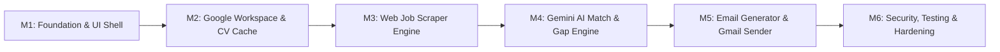

# Project Roadmap & Milestones Breakdown
## Project: Job Seek Assistant (Chrome & Edge Extension)

Roadmap ini membagi pengembangan sistem ke dalam 6 Milestone utama dengan tujuan (*objectives*) kecil dan terukur. Setiap tugas mewajibkan pembuatan dokumentasi teknis dan panduan pengujian (manual & otomatis).

---

---

### Milestone 1: Extension Foundation, UI Shell & State Infrastructure
*Fokus: Membangun fondasi ekstensi Manifest V3, antarmuka Side Panel Vue 3 dengan Tailwind CSS, konfigurasi TypeScript & Vitest, serta layer penyimpanan lokal.*

* [x] **Objective 1.1: Setup Side Panel, Tailwind CSS & Routing/Tab Structure**
  * Konfigurasi Manifest V3 untuk Chrome Side Panel API (`side_panel` dan `sidePanel` permission).
  * Konfigurasi **Tailwind CSS** untuk tata letak modern dan responsif.
  * Buat tata letak Side Panel modular dengan tab navigasi: **Analisa Lowongan**, **Email Generator**, **Profil & CV**, dan **Pengaturan**.
  * Tambahkan dukungan tema (*clean UI*) yang pas dengan batasan lebar Side Panel.
  * *Dokumentasi & Testing*: `docs/features/sidepanel-ui.md` + manual UI checklist.

* [x] **Objective 1.2: Local Storage Engine & Type Definitions**
  * Buat wrapper reaktif di atas `chrome.storage.local` untuk menyimpan state CV, pengaturan API key, dan riwayat analisis.
  * Tentukan tipe data inti TypeScript di `src/types/` (`CVProfile`, `JobDetails`, `AnalysisResult`, `EmailDraft`).
  * *Dokumentasi & Testing*: Unit test wrapper storage dengan mock `chrome.storage.local` menggunakan Vitest.

---

### Milestone 2: Google Workspace Integration & CV Memory Engine
*Fokus: Otentikasi OAuth2 Google, integrasi Google Drive API untuk pembacaan CV (PDF & Google Docs), ekstraksi teks dokumen, dan sinkronisasi berkala.*

* [x] **Objective 2.1: Google OAuth2 Authentication Flow**
  * Konfigurasi `chrome.identity` untuk otentikasi Google Workspace.
  * Implementasikan *token manager* dengan *auto-refresh* dan deteksi status login di UI.
  * *Dokumentasi & Testing*: Panduan setup OAuth Client ID di Google Cloud Console + manual test skenario login/logout/revoke token.

* [x] **Objective 2.2: Google Drive CV Selector & Parser (PDF & Google Docs)**
  * Hubungkan ke Google Drive API v3 untuk memilih file CV.
  * Ekstrak teks lengkap:
    - Format **PDF**: Ekstraksi berbasis engine PDF parser / PDF.js.
    - Format **Google Docs**: Ekstraksi via endpoint export Drive API (`mimeType=text/plain`).
  * Simpan metadata (`fileId`, `checksum/modifiedTime`, `parsedAt`) dan teks hasil ekstraksi ke `chrome.storage.local`.
  * *Dokumentasi & Testing*: `docs/features/gdrive-cv-sync.md` + automated test parsing dokumen & mocking response Drive API.

* [x] **Objective 2.3: CV Synchronization & Change Detection**
  * Buat tombol "Sync / Update CV" di UI Side Panel.
  * Implementasikan pengecekan `modifiedTime` file Drive untuk memperbarui memori lokal secara efisien jika terjadi revisi CV.
  * Sediakan opsi input/paste CV manual sebagai cadangan (*fallback*).
  * *Dokumentasi & Testing*: Unit test logika perbandingan timestamp & manual test verifikasi perubahan konten CV.

---

### Milestone 3: Content Script & Active Web Job Extractor
*Fokus: Mengambil informasi lowongan kerja secara real-time dari halaman aktif di browser pengguna.*

* [x] **Objective 3.1: Content Script DOM Reader & Portals Support**
  * Buat Content Script di `src/content/main.ts` dengan parser khusus untuk portal kerja utama: LinkedIn Jobs, Glints, Jobstreet, dan Indeed.
  * Ekstrak: Judul Posisi, Nama Perusahaan, Lokasi, Deskripsi, Persyaratan, dan Kontak Email.
  * *Dokumentasi & Testing*: `docs/features/job-scraper.md` + unit test dengan DOM snapshot fixture untuk masing-masing portal.

* [x] **Objective 3.2: Universal Heuristic Fallback Reader**
  * Buat algoritma pembersihan konten dan ekstraksi artikel utama untuk halaman karir independen perusahaan (mengabaikan navbar, footer, sidebar iklan).
  * Tambahkan sanitasi teks untuk mencegah *indirect prompt injection*.
  * *Dokumentasi & Testing*: Unit test sanitasi teks & manual test pada 3 situs karir perusahaan acak.

* [x] **Objective 3.3: Side Panel Extraction Bridge & Manual Review Form**
  * Hubungkan Content Script ke Side Panel menggunakan `chrome.runtime.sendMessage`.
  * Sediakan UI review dan edit cepat di Side Panel agar pengguna dapat melengkapi informasi jika ada teks yang tidak tertangkap sempurna.
  * *Dokumentasi & Testing*: Manual test interaksi klik tombol "Ambil Data Halaman Ini" di Side Panel.

---

### Milestone 4: Gemini AI Integration & Grounded Matching Engine
*Fokus: Menghubungkan ekstensi ke Gemini AI, menerapkan aturan grounding anti-halusinasi, serta menampilkan skor relevansi dan gap analysis.*

* [x] **Objective 4.1: Gemini Client & API Configuration**
  * Implementasikan service pemanggil Google Gemini API (model `gemini-1.5-flash` / `gemini-2.0-flash`).
  * Sediakan form konfigurasi API key aman di tab Pengaturan dengan validasi koneksi instan.
  * *Dokumentasi & Testing*: `docs/features/gemini-service.md` + unit test service dengan mock HTTP/SDK.

* [x] **Objective 4.2: Structured Grounded Match & Gap Analysis**
  * Terapkan prompt sistem terpandu (sesuai `plans/AI_ASSISTANT_GUARDRAILS.md`).
  * Parsing output JSON menjadi komponen UI interaktif: Skor Relevansi (0–100%), Matched Skills, Skill Gaps, dan Tips Interview.
  * Tambahkan validasi post-generation untuk memastikan tidak ada klaim keahlian di luar data CV.
  * *Dokumentasi & Testing*: Unit test JSON parser validator & evaluasi zero-hallucination dengan sample CV vs Lowongan.

---

### Milestone 5: Personalized Email Generator, Multi-Language Support, Iterative Refinement & Gmail Dispatch
*Fokus: Membuat rekomendasi subject & body email lamaran berbasis AI dengan dukungan pemilihan bahasa (Bahasa Indonesia / English / Auto), masukan perubahan pengguna (*iterative refinement*), serta opsi simpan ke draft atau kirim langsung via Gmail API.*

* [x] **Objective 5.1: Multi-Tone & Multi-Language Email Template Generation & Iterative Refinement**
  * Buat prompt generator untuk menghasilkan 3 opsi gaya email: *Formal*, *Impact/Project-focused*, dan *Concise Pitch*.
  * **Fitur Pemilihan Bahasa (Email Language Selection)**:
    - Pengguna dapat memilih bahasa email yang diinginkan: **Bahasa Indonesia**, **English**, atau **Auto (Mengikuti bahasa deskripsi lowongan)**.
    - AI menyesuaikan tata bahasa, etika korespondensi, subjek, serta salam pembuka/penutup sesuai bahasa yang dipilih tanpa menerjemahkan istilah teknis (*tech stack/skills*) secara keliru.
    - Preferensi bahasa tersimpan otomatis di `chrome.storage.local`.
  * Tampilkan tab preview email dengan editor teks interaktif (*subject* & *body* dapat disunting manual langsung).
  * Sediakan fitur **"Masukan Perubahan"**: Pengguna dapat memberikan instruksi revisi (prompt masukan) ke AI untuk memperhalus, mengubah penekanan draf, atau beralih bahasa.
  * Auto-fill email penerima jika recruiter email terdeteksi pada tahap ekstraksi.
  * *Dokumentasi & Testing*: `docs/features/email-generator.md` + unit test variasi template, pemilihan bahasa, dan prompt revisi.

* [x] **Objective 5.2: Dual Dispatch Option: Save to Draft or Direct Send via Gmail API**
  * Buat utilitas pembentuk pesan email MIME RFC 2822 base64url-encoded di background service worker.
  * Dukung opsi menyertakan file CV asli dari Google Drive sebagai lampiran PDF.
  * Sediakan dua tombol aksi yang jelas:
    - **"Simpan ke Draft"**: Memanggil Gmail API endpoint `users.me.drafts.create`.
    - **"Kirim Email Langsung"**: Memanggil Gmail API endpoint `users.me.messages.send` dengan modal konfirmasi ringkasan.
  * Tampilkan status riwayat pengiriman/pembuatan draf.
  * *Dokumentasi & Testing*: `docs/features/gmail-send.md` + unit test MIME builder + manual test simpan draf & kirim email.

---

### Milestone 6: Quality Assurance, Security Hardening & Polish
*Fokus: Pengujian menyeluruh, penanganan error edge-case, optimalisasi performa, dan dokumentasi rilis.*

* [x] **Objective 6.1: End-to-End Edge Case & Error Resilience**
  * Tangani kondisi offline, token expired (otomatis re-auth), file CV tidak ditemukan, dan limit kuota Gemini API.
  * Berikan pesan kesalahan yang ramah pengguna dan solutif.
  * *Dokumentasi & Testing*: Matriks penanganan error di `docs/testing/error-matrix.md`.

* [x] **Objective 6.2: Automated Test Suite & CI Verification**
  * Integrasikan seluruh unit test di Vitest (`npm run test`).
  * Pastikan linting dan typecheck lulus tanpa error (`npm run build`).
  * Dokumentasikan panduan instalasi lengkap untuk pengguna di `README.md`.
