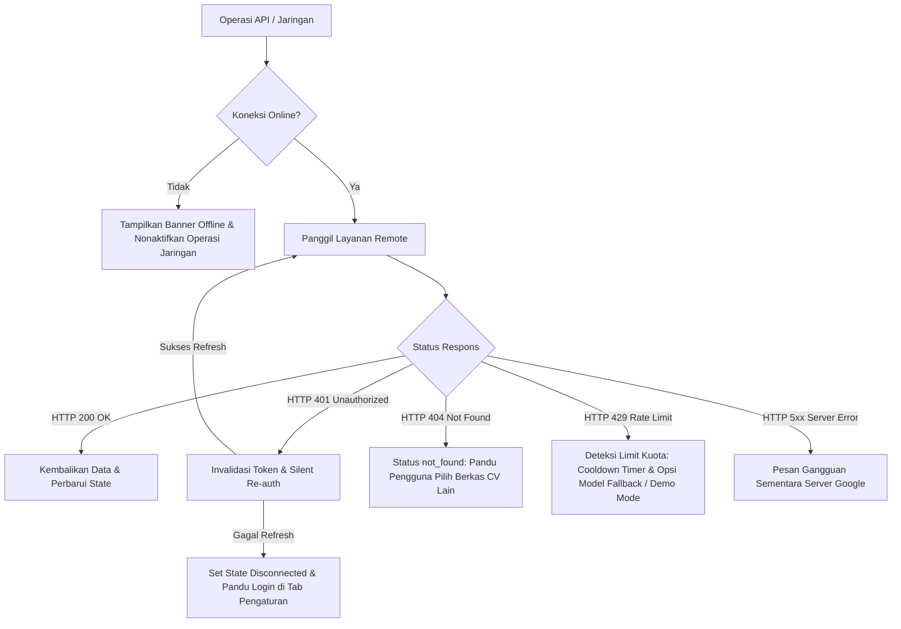

# Error Handling & Resilience Matrix
## Job Seek Assistant (Chrome & Edge Extension)

Dokumen ini mendokumentasikan secara teknis arsitektur ketahanan sistem (*error resilience*), deteksi *edge-case*, mitigasi otomatis, serta panduan resolusi bagi pengguna dan tim QA.

---

## 1. Arsitektur Ketahanan & Prinsip Desain

Sistem dibangun dengan prinsip **Graceful Degradation** dan **Zero Fatal Crashes**:
1. **Offline-First UI**: Jika koneksi internet terputus, fitur offline (inspeksi cache CV lokal, penyuntingan draf subjek/body email, review riwayat) tetap dapat diakses tanpa hambatan. Banner status di Side Panel memberi tahu pengguna secara non-intrusif.
2. **Silent Token Refresh & Auto-Retry**: Operasi Google API (Google Drive & Gmail) yang mengalami *token expiration* (HTTP 401) secara otomatis memicu invalidasi token lokal, mengambil token baru via `GoogleAuthService.getValidToken(false)`, dan mengulang kembali permintaan tanpa membingungkan pengguna.
3. **Actionable Guidance**: Setiap pesan error disajikan dalam Bahasa Indonesia yang ramah pengguna, bebas dari *cryptic stack trace*, dan disertai langkah solusi konkret (misal: tombol pilih berkas lain, hitung mundur cooldown, atau opsi beralih ke Mode Simulasi Demo).

---

## 2. Matriks Penanganan Error (Error Matrix)

| Kategori | Skenario Pemicu | Deteksi Teknis | Aksi Otomatis Sistem | Pesan Kesalahan Pengguna (UI) | Solusi Bagi Pengguna |
| :--- | :--- | :--- | :--- | :--- | :--- |
| **Koneksi Jaringan** | Perangkat terputus dari internet / WiFi mati | `!navigator.onLine` atau `TypeError: Failed to fetch` | Banner offline muncul di UI Side Panel; cegah panggilan remote sia-sia. | *"Koneksi internet terputus (offline). Tidak dapat mengakses layanan online."* | Periksa koneksi WiFi/kabel internet Anda. Fitur lokal tetap dapat digunakan. |
| **Google OAuth** | Token akses Google kedaluwarsa saat memanggil Drive / Gmail | HTTP 401 `Unauthorized` / `isAuthError: true` | Panggil `invalidateToken` & minta token baru secara senyap (*silent re-auth*), lalu ulangi request. | *"Sesi Google Workspace telah berakhir. Silakan klik tombol 'Hubungkan Akun Google' di tab Pengaturan."* (hanya jika auto re-auth gagal) | Hubungkan kembali akun Google Anda di tab Pengaturan. |
| **Google OAuth** | Pengguna membatalkan dialog login Google OAuth | `chrome.runtime.lastError` mengandung `canceled` / `user cancelled` | Batalkan proses otentikasi tanpa merusak state yang ada. | *"Login dibatalkan oleh pengguna."* | Klik kembali tombol "Hubungkan Akun Google" jika ingin melanjutkan otentikasi. |
| **Google Drive** | Berkas CV telah dihapus atau dipindahkan ke Trash di Drive | HTTP 404 `Not Found` / `isNotFoundError: true` | Layanan `cvSync` menetapkan status `'not_found'` dan menghentikan proses parsing. | *"Berkas CV tidak lagi ditemukan di Google Drive (mungkin terhapus atau dipindahkan ke Sampah). Silakan pilih berkas CV lain."* | Buka tab **Profil & CV**, lalu klik tombol **Pilih Berkas CV** dari Drive atau gunakan input manual. |
| **Google Drive** | Berkas Drive berukuran 0 byte atau dokumen kosong | `rawText.trim().length === 0` | Validasi post-download mendeteksi string kosong dan membatalkan penimpaan profil. | *"Konten teks dokumen kosong atau tidak terbaca. Pastikan berkas CV berisi teks yang dapat disalin."* | Unggah atau gunakan berkas PDF/Docs yang memuat teks riwayat pengalaman kerja. |
| **Google Drive** | Izin berkas Drive dibatasi (*restricted access*) | HTTP 403 `Forbidden` | Lempar `GoogleDriveError` khusus izin akses. | *"Izin akses Google Drive ditolak. Pastikan akun Google Anda memiliki hak akses membaca berkas ini."* | Pastikan berkas Drive dapat diakses oleh akun Google yang sedang terhubung. |
| **Gemini AI** | Batas permintaan API per menit/hari habis (*Rate Limit*) | HTTP 429 `RESOURCE_EXHAUSTED` / `isRateLimit: true` | Mulai hitung mundur cooldown (45 detik); tawarkan beralih model atau Demo Mode. | *"Batas kuota Gemini API (Rate Limit 429 / RESOURCE_EXHAUSTED) tercapai. Silakan tunggu 30-60 detik, beralih ke model lain di tab Pengaturan, atau gunakan Mode Demo."* | Tunggu hingga hitungan mundur selesai, ganti model ke versi Flash lain, atau centang Mode Demo di Pengaturan. |
| **Gemini AI** | Model AI yang diminta tidak tersedia di versi API | HTTP 404 pada generateContent | Query `ModelService.ListModels` secara dinamis dan *fallback* ke model Flash terbaik yang tersedia. | Transparan (otomatis pulih di latar belakang dan memperbarui pengaturan model aktif). | Tidak ada aksi yang diperlukan; sistem memulihkan secara otomatis. |
| **Gemini AI** | API Key Gemini salah atau tidak valid | HTTP 400 / 403 pada Google AI Studio | Hentikan pemanggilan AI dan tandai status validasi sebagai tidak valid. | *"API Key Gemini tidak valid atau tidak memiliki akses ke Google AI Studio. Periksa kembali di tab Pengaturan."* | Buka tab **Pengaturan**, periksa atau buat API Key baru di [Google AI Studio](https://aistudio.google.com/). |
| **Gemini AI** | Batas waktu respon AI melebihi batas (*timeout*) | `AbortController.signal` terpicu (> 45 detik) | Batalkan koneksi fetch gantung untuk membebaskan memori peramban. | *"Permintaan ke Gemini API melebihi batas waktu (timeout). Silakan periksa stabilitas koneksi internet Anda."* | Periksa kestabilan koneksi internet lalu coba analisis kembali. |
| **Gmail API** | Scope izin Gmail belum diberikan pengguna | HTTP 403 `insufficientPermissions` | Identifikasi scope `gmail.compose` / `gmail.send` yang belum diizinkan. | *"Izin Gmail tidak mencukupi untuk mengirim email. Pastikan Anda telah menyetujui izin Gmail saat menghubungkan akun."* | Hubungkan ulang akun Google di tab Pengaturan dan centang seluruh izin yang diminta. |
| **Gmail API** | Format alamat email penerima tidak sesuai standar RFC | Regex `^[^\s@]+@[^\s@]+\.[^\s@]+$` gagal | Validasi form pra-pengiriman memblokir tombol aksi dan menampilkan pesan peringatan. | *"Format alamat email penerima tidak valid. Pastikan penulisan sesuai contoh: recruiter@perusahaan.com"* | Perbaiki format email penerima pada form editor. |
| **Web Scraper** | Ekstensi dijalankan pada halaman internal browser (`chrome://`, `edge://`) | Deteksi prefix URL pada active tab | Blokir pengiriman pesan ke tab dan beri tahu pengguna. | *"Halaman sistem peramban tidak dapat diekstrak. Silakan buka halaman lowongan kerja pada website publik."* | Buka tab situs lowongan kerja publik (misal: LinkedIn, Glints, Jobstreet) sebelum mengekstrak. |
| **Web Scraper** | Ekstraksi pada halaman non-lowongan (artikel berita, medsos) | Parser mengembalikan judul dan deskripsi kosong | Tampilkan form kosong dengan placeholder dan panduan pengisian manual. | *"Informasi lowongan tidak terdeteksi otomatis. Anda dapat melengkapi judul dan deskripsi lowongan secara manual."* | Isi kolom posisi pekerjaan dan deskripsi secara manual di tab Analisa. |
| **Anti-Hallucination** | Output AI mengandung klaim keahlian yang dilarang (*hallucination*) | Guardrail regex validator mendeteksi missing skills muncul di bagian klaim positif | Guardrail memfilter dan menandai temuan dengan peringatan visual kuning. | *"Peringatan Guardrail: Ditemukan keahlian yang tidak tercantum dalam CV Anda. Harap tinjau kembali sebelum mengirim."* | Tinjau daftar kualifikasi yang belum terpenuhi dan sesuaikan draf email. |

---

## 3. Matriks Simulasi Mode Demo (Demo Mode Matrix)

Untuk memfasilitasi pengujian tanpa ketergantungan pada kredensial Google Cloud atau Google AI Studio:

| Fitur | Perilaku Mode Nyata (*Production*) | Perilaku Mode Simulasi (*Demo Mode*) |
| :--- | :--- | :--- |
| **Otentikasi Google** | Menjalankan OAuth2 `launchWebAuthFlow` ke Google Accounts | Memberikan profil mock instan: `Test User (Demo)` |
| **Google Drive CV** | Mengambil berkas PDF / Docs langsung dari Google Drive v3 | Menyediakan 3 pilihan berkas CV mock siap pakai dengan ekstraksi instan |
| **Gemini AI Match** | Memanggil endpoint Google Generative Language v1beta | Menghasilkan skor kecocokan realistis (~85%), matched skills, dan interview tips terukur |
| **Email Generator** | Mengirimkan prompt kontekstual ke LLM Gemini | Menghasilkan 3 variasi draf (Formal, Impact, Concise) dengan multi-bahasa instan |
| **Gmail Dispatch** | Menghubungi Gmail API endpoint `drafts.create` / `messages.send` | Mensimulasikan jeda jaringan dan mengembalikan mock `draftId` / `messageId` sukses |

---

## 4. Panduan Pengujian QA & Verifikasi Manual

1. **Pengujian Skenario Offline**:
   - Buka Google Chrome DevTools -> Tab **Network** -> Pilih opsi **Offline**.
   - Buka Side Panel ekstensi: Banner kuning `"Mode Offline"` wajib terlihat.
   - Coba tekan tombol analisis atau kirim email: Validasi offline mencegah fetch gantung.
   - Kembalikan status ke **Online**: Banner hijau `"Koneksi internet terhubung kembali!"` muncul selama 4 detik lalu menghilang.

2. **Pengujian Skenario Token Expired (401)**:
   - Hubungkan akun Google, lalu simulasikan token tidak valid di console:
     `chrome.storage.local.set({ app_settings: { ...settings, googleAccessToken: 'token_rusak' } })`
   - Lakukan sinkronisasi CV atau pengiriman draft: Service worker secara otomatis mendeteksi 401 dan memicu *silent refresh*.

3. **Pengujian Skenario CV Dihapus (404)**:
   - Buat CV dengan `fileId` acak yang tidak ada di Google Drive.
   - Tekan tombol "Sync / Update CV": Sistem wajib menampilkan pesan bahwa berkas tidak ditemukan di Drive, tanpa terjadinya *unhandled promise rejection*.

4. **Pengujian Kuota Gemini Habis (429)**:
   - Masukkan API Key yang telah mencapai limit atau simulasikan respon 429.
   - Sistem wajib memulai hitungan mundur waktu tunggu dan menyajikan alternatif beralih model atau menggunakan Mode Demo.
